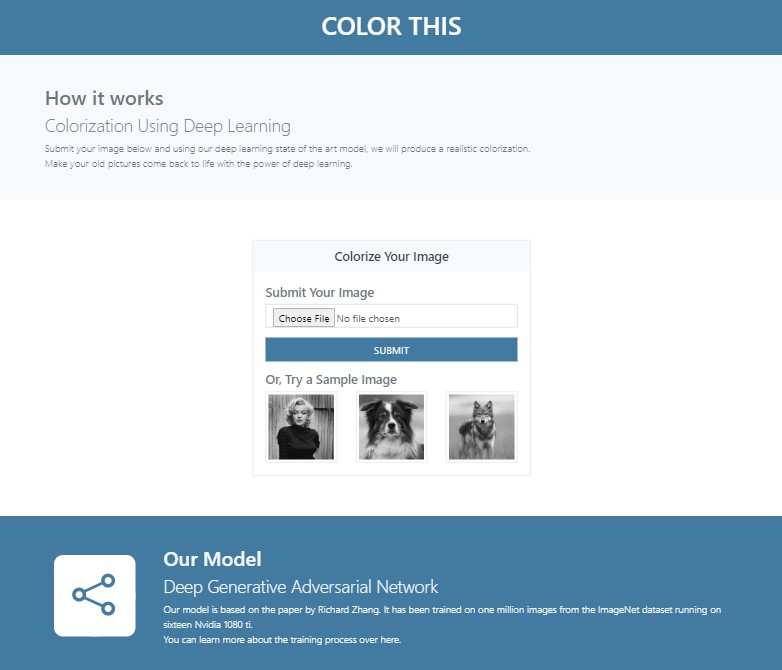

# Color This

Web Application for Image Colorization using Deep Generative Adversarial Network.

## [Demo](https://)

The site is hosted [here](https://).

## [Model](https://github.com/asimsedhain/Image-Colorization-GAN)

The colorization model is based off of this [paper](https://richzhang.github.io/ideepcolor/).
You can learn more about our training process by heading over to the model repo [here](https://github.com/asimsedhain/Image-Colorization-GAN).

## TODO
- [x] Improve UI
- [x] Change queue to get the whole image
- [ ] Add User Interaction
- [ ] Add Documentation
- [	] Refactor
- [ ] Deploy to Azure Kubernetes
